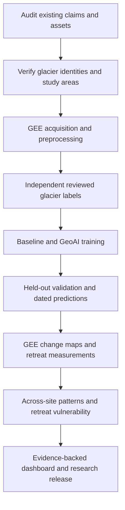

# Plan B: Complete the glacier research objectives

**Prepared:** 21 September 2026

**Status:** Phase 0 implementation started. Safety guards, legacy archive, initial asset audit and regression tests are implemented; G0–G7 are not yet complete. See [implementation status](docs/planb-implementation.md).

**Primary outcome:** A reproducible, validated workflow from multi-date satellite imagery to glacier boundaries, measured change, and spatial/temporal retreat analysis.

## 1. Objectives and scope

The four objectives in the supplied screenshot are the acceptance criteria:

1. Acquire and preprocess multi-temporal Sentinel-2 imagery of selected Himalayan glaciers using Google Earth Engine (GEE).
2. Develop a GeoAI model for automatic detection and delineation of glacier boundaries.
3. Perform multi-temporal glacier change detection and mapping using GEE.
4. Analyze spatial and temporal patterns of glacier retreat and identify vulnerable regions.

The existing GlacierLens application will present the results. A functioning dashboard alone does not complete any scientific objective.



### Scope boundaries

- Start with South Lhonak as an end-to-end pilot, then extend to the five currently selected glacier systems.
- Retain Tsho Rolpa/Trakarding, Imja–Lhotse Shar, Thulagi, and Chhota Shigri as provisional additional sites until identity checks pass.
- Target comparable annual observations for 2016–2025, subject to actual data availability and preprocessing compatibility. Record genuine gaps.
- Add 2026 only after the chosen seasonal window is complete and observations pass review. As of this plan, October–November 2026 has not occurred.
- Treat pre-/post-October-2023 event imagery as a separate comparison from the annual seasonal series.
- Define vulnerability initially as susceptibility to observed glacier retreat and associated glacier–lake change. Do not equate it with flood probability, exposure, or a validated GLOF hazard class.
- Defer forecasts, LSTMs, melt scenarios, operational alerts, new 3D features, and cosmetic dashboard work until the four objectives pass their gates.
- Prefer an honest partial result with explicit exclusions over a complete-looking fabricated time series.

## 2. Verified starting point

These observations describe the local repository at the time of the audit, not external datasets or uninspected runs.

| Component | Verified state | Consequence |
| --- | --- | --- |
| Five-site evidence bundle | One real 2025 raster per site; observations marked `review_candidate` | Acquisition exists, but a reviewed multi-date dataset is incomplete |
| Historical glacier overlays | Inventory reference geometries | Useful for identity/context; not annual ground truth |
| Training feature manifest | 50 referenced feature assets; none exists at its recorded path | Manifest entries cannot count as processed training data |
| Training-mask manifest | 50 referenced reviewed masks; none exists at its recorded path | No usable training pairs |
| Current segmentation trainer | Random Forest implementation; execution exits with code 2 because no `approved_reviewed` pairs exist | Code foundation exists; trained and validated model does not |
| Older model directory | U-Net placeholder file | Not a trained model artifact |
| Active retreat datasets | Approved observations and measurements are empty; synthetic fixtures quarantined | No approved research time series |
| `prepare_features.py` | Writes metadata; comments defer actual feature-raster output | Needs real feature production |
| `measure_retreat.py` | Calls deterministic demo generation, including without `--dry-run` | Must not be used for scientific measurements |
| Older validation register | Claims IoU 0.82/F1 0.90 and passed gates | Unsupported by the current workflow; requires correction |
| Site definitions | Older final-site configuration contains fixed dates, approval claims, and identities inconsistent with newer evidence | Reconcile before analysis |

## 3. Phase 0 — Restore trustworthy project state

**Purpose:** Ensure old demonstration artifacts cannot masquerade as scientific results.

### Implementation tasks

- [ ] Inventory model files, masks, rasters, vectors, measurements, metrics, and their consumers. Record existence, provenance, status, and content hashes.
- [ ] Trace imports from site configurations and data modules into the UI; identify every route that can expose stale claims.
- [ ] Mark unsupported model/validation reports as superseded and unverified. Preserve them in an explicitly excluded archive for traceability.
- [ ] Remove unsupported accuracy, approved-date, forecast, and readiness claims from active configurations and documentation.
- [ ] Make demo generation an explicit opt-in that writes only to an excluded demonstration directory. Scientific execution must never silently fall back to fixtures.
- [ ] Update the product definition, roadmap, and boundary policy to support validated GeoAI as a core objective.
- [ ] Separate input approval, model-output review, and release approval; a model prediction must not become independent reference truth by changing a status string.
- [ ] Change evaluation so research release does not require the deferred forecast pipeline.

**Files to address:** `data/catalog/phase-2-validation-register.md`, `data/catalog/phase-2-model-manifest.json`, `data/derived/phase2/validation/`, `apps/web/src/data/sites/final-study-sites.ts`, `apps/web/src/data/retreat/`, `pipelines/geoai/prepare_features.py`, `pipelines/geoai/measure_retreat.py`, `pipelines/geoai/evaluate_models.py`, and relevant `docs/` files.

**Deliverables:** An asset audit, corrected status records, an explicit archive of unsupported results, and one authoritative site/observation registry.

**Gate G0 — practical tests:** Missing scientific inputs cause an explicit failure; no scientific command generates synthetic replacements. Active UI imports do not reach quarantined fixtures. Every displayed approval or performance claim resolves to actual supporting evidence.

## 4. Phase 1 — Freeze the study protocol and verify sites

### Implementation tasks

- [ ] Verify each glacier name, inventory ID, geometry, associated lake where applicable, and study-area extent against authoritative source records.
- [ ] Resolve conflicting IDs/names between the newer evidence bundle and older site configuration. Do not infer lake existence from a site label such as “Chhota Shigri Lake.”
- [ ] Ensure each study area includes the full target glacier, possible historical extent, terminus, stable terrain for alignment checks, and surrounding negative examples. Existing lake-centered bounding boxes may be too small.
- [ ] Define glacier extent consistently: clean ice, debris-covered ice, connected accumulation areas, disconnected snow, and lake water. Record how ambiguous zones are handled.
- [ ] Choose whether adjoining glacier branches are separate units or a fixed combined complex; preserve that definition across dates.
- [ ] Specify seasonal selection rules, acceptable cloud/snow/shadow coverage, fallback windows, and exclusion reasons before inspecting trends.
- [ ] Verify GEE collection availability for every requested year. Do not silently mix surface-reflectance and top-of-atmosphere products to fill early-year gaps. Document a harmonization/processing strategy or explicitly mark unavailable periods.
- [ ] Select an appropriate projected CRS per site for metric analysis; do not force all Himalayan sites into EPSG:32645. Keep display coordinates separate.
- [ ] Define temporal and glacier-held-out splits before training. Reserve independent test labels; prohibit tuning thresholds on them.
- [ ] Define “retreat vulnerability,” eligible indicators, uncertainty handling, and geographic limits of the conclusions.

**Deliverables:** A study protocol, verified site registry, coverage matrix, label handbook, and frozen split specification.

**Gate G1:** Each site has a verified target geometry, sufficient spatial coverage, a declared CRS, and a documented sampling/label policy. Unresolved identities are excluded from training and comparisons until resolved.

## 5. Phase 2 — Build real multi-date imagery and feature stacks

**Reuse:** `preflight_gee.py`, `inventory_sentinel2.py`, and `prepare_site_evidence.py`.

### Implementation tasks

- [ ] Run GEE access checks and inventory actual scenes within the protocol windows.
- [ ] For the pilot, first obtain at least three usable dates spanning the available period to exercise acquisition and change mapping. Three dates demonstrate plumbing, not robust model validation or a long-term trend.
- [ ] Expand pilot training/validation coverage with enough independent scenes to populate the frozen splits; document actual counts and limitations.
- [ ] Apply cloud, cloud-shadow, invalid-pixel, and appropriate snow handling. Preserve ambiguous pixels as unknown; seasonal snow policy must not erase valid glacier accumulation areas.
- [ ] Measure usable coverage over the target glacier and terminus, not just the surrounding bounding box. Reject a scene if the critical terminus is obscured despite high overall clear coverage.
- [ ] Prefer a single interpretable scene for boundary labeling. If composites are necessary, preserve contributing scene IDs/date ranges and evaluate seam or temporal-smearing effects.
- [ ] Export real spectral rasters and quality masks. Build actual feature stacks from selected bands, spectral indices, and terrain variables.
- [ ] Fix one grid per site: CRS, transform, extent, and pixel size. Resample categorical masks with nearest neighbor; document continuous-band resampling and native source resolutions.
- [ ] Check inter-date alignment using stable terrain. Correct or exclude misregistered scenes and include residual displacement in uncertainty.
- [ ] Record checksums, source IDs, dates, collection/processing version, units, scale factors, band order, quality coverage, and transformation parameters.
- [ ] Support restartable exports and explicit failure records; avoid repeatedly downloading successful assets.

**Deliverables:** Real feature GeoTIFFs, valid-pixel masks, a coverage/quality report, and manifests referencing existing files.

**Gate G2 — practical tests:** Open each pilot raster in GIS; overlay the glacier and verify full coverage. Assert matching grids across dates, valid band values, no empty exports, and correct units. Deliberately supply an obscured terminus, missing band, or shifted grid: each must fail or receive a documented exclusion. A manifest alone cannot pass.

## 6. Phase 3 — Produce independent reviewed labels

### Implementation tasks

- [ ] Digitize dated glacier boundaries from the source observations using the label handbook. Use historical inventory outlines as context only.
- [ ] Record reviewer identity, review date, source scene, method, ambiguous areas, and limitations. Never invent reviewer sign-off.
- [ ] Keep independent test labels separate from model-assisted operational boundary review. Test annotators should not copy the predictions being evaluated.
- [ ] Include difficult conditions: debris, shadow, snow confusion, lakes, moraines, and neighboring non-glacier terrain.
- [ ] Add second-review checks for ambiguous termini and a representative label subset; quantify disagreements where possible.
- [ ] Adapt `build_training_masks.py` to use separate codes for background, glacier, and ignored/invalid pixels. Currently setting NoData to zero conflates valid background with missing data.
- [ ] Require label/feature agreement in CRS, transform, dimensions, and scene identity. Validate geometry and overlap before writing final artifacts.
- [ ] Partition records by scene and glacier according to the frozen split. Keep tiles and composites sharing source acquisitions together.

**Deliverables:** Reviewed dated vectors, raster labels with explicit ignore masks, review records, and split manifests.

**Gate G3:** Every training/test label traces to dated imagery and an actual review. Unknown pixels do not enter either class. Automated checks prove no shared source scene crosses train/test boundaries. If review cannot be completed, report the dependency and continue independent engineering work without fabricating labels.

## 7. Phase 4 — Train, validate, and run GeoAI delineation

### Implementation tasks

- [ ] Implement a transparent spectral baseline, with thresholds chosen using training/validation data only. Document expected limitations on debris and seasonal snow.
- [ ] Complete the existing Random Forest pipeline as the first GeoAI model. Deep learning is optional later if data and measured errors justify it.
- [ ] Check feature names/order, units, grid metadata, valid-pixel masks, and both label classes before fitting.
- [ ] Use chronological validation for future-date transfer and leave-one-glacier-out evaluation once multiple sites are ready. Keep tuning and final testing separate.
- [ ] Address class imbalance using training-only choices. Evaluate final predictions over full valid test regions, not only convenient sampled pixels.
- [ ] Report IoU, precision, recall, F1, boundary-position error, sample counts, and per-scene/per-site breakdowns. Include debris/clean-ice distinctions where labels support them.
- [ ] Quantify uncertainty using independent scenes/sites as units; do not treat millions of correlated pixels as millions of independent observations.
- [ ] Add full-raster inference, probability output, documented polygonization/postprocessing, and geometry validation. A classifier checkpoint alone does not delineate usable boundaries.
- [ ] Evaluate automatic outputs before any manual correction. Record corrected outputs separately and quantify editing effort.
- [ ] Save the fitted model, dependency versions, feature schema, split, random seed, configuration, input hashes, and evaluation results together.
- [ ] Treat probability values as uncalibrated until calibration is tested; low-confidence output should trigger review or abstention.

**Deliverables:** A real model artifact, inference command, dated automatic glacier polygons, baseline comparison, and a reproducible held-out evaluation report.

**Gate G4:** An unseen observation produces a boundary without manual tracing. Metrics are calculated against independent labels. Define performance and positional-error targets in the protocol before testing; do not adopt the old 0.82 IoU claim as a result or promise. If GeoAI fails the baseline or the positional-error budget, record that finding and restrict its use rather than claiming success.

## 8. Phase 5 — Measure change and produce GEE maps

**Purpose:** Replace demo trajectories with calculations from dated geometry and valid imagery.

### Implementation tasks

- [ ] Replace `generate_demo_measurements()` in the scientific measurement path with real raster/vector processing.
- [ ] Define comparable boundaries of the same glacier unit and a fixed analysis domain. Distinguish automatic and analyst-corrected series.
- [ ] Compute area per date, absolute and percentage change, interval duration, and annualized rates using actual acquisition dates.
- [ ] Define a fixed reference flowline or transect set for terminus displacement, including sign convention, branches, and invalid-intersection handling. Area loss and terminus retreat are different quantities.
- [ ] Propagate mapping and co-registration uncertainty. Report changes below the detection limit as unresolved, not confidently positive/negative.
- [ ] Implement actual GEE change-map production from dated masks or reviewed exported boundaries: persistent glacier, glacier loss, glacier gain, and unknown.
- [ ] Use the intersection of valid coverage for pixel comparisons. Report observed-domain change separately when obscuration prevents full-glacier measurement.
- [ ] Compare GEE summaries with an independent local projected-geometry calculation; define numeric tolerance from rasterization and boundary uncertainty.
- [ ] Produce elevation-band, slope, and aspect summaries with appropriate valid-area denominators. Do not claim elevation/volume loss from planimetric area changes.
- [ ] Calculate lake area and glacier–lake distance only where dated, supported lake geometry exists. Keep these optional to glacier analysis.

**Deliverables:** Per-date measurement tables, interval change tables, GeoJSONs, GEE change rasters/maps, uncertainty fields, and independent GIS verification notes.

**Gate G5 — practical tests:** Identical masks produce zero change; known-size geometry produces the expected area; a controlled terminus translation produces the expected signed displacement. Masked regions remain unknown. For one real date pair, independently reproduce area and terminus calculations in GIS and reconcile differences within a predeclared tolerance.

## 9. Phase 6 — Extend across sites and analyze patterns

### Implementation tasks

- [ ] Repeat the proven acquisition, labeling, inference, and measurement workflow for each verified site.
- [ ] Publish a coverage matrix showing usable, excluded, and missing dates with reasons. Do not fill annual gaps with fabricated observations.
- [ ] Compare absolute and normalized area changes, interval retreat rates, and their uncertainties over matched periods where possible.
- [ ] Examine elevation-band, slope/aspect, terminus, and glacier–lake patterns; distinguish observed associations from causal explanations.
- [ ] Fit trends only where temporal coverage supports them. Report irregular sampling and avoid interpreting a three-date pilot as a robust decadal trend.
- [ ] Keep the 2023 South Lhonak event comparison distinct from the regular seasonal series; test whether conclusions depend on event inclusion.
- [ ] First identify retreat hotspots using transparent measured indicators. If a composite vulnerability score is needed, publish normalization, weights, missing-data rules, and sensitivity tests.
- [ ] Withhold rankings where uncertainty or data gaps make ordering unstable. Never count a missing indicator as zero vulnerability.
- [ ] Limit regional language to the sampled glacier systems; five selected glaciers cannot establish a Himalayan-wide hazard map.

**Deliverables:** Across-site comparison tables, spatial change/hotspot maps, trend figures, vulnerability method/results, and a limitations statement.

**Gate G6:** Every conclusion can be traced to measurements and source observations. Recalculate under plausible uncertainty, weight, and period choices; label unstable conclusions. No retreat metric is described as GLOF probability.

## 10. Phase 7 — Integrate verified results and release

- [ ] Generate presentation datasets from validated pipeline outputs rather than hand-maintained values.
- [ ] Show actual dates, observed gaps, historical references, automatic predictions, reviewed boundaries, and uncertainty with distinct labels.
- [ ] Provide image/boundary overlays and persistent/loss/gain/unknown change layers.
- [ ] Show area and terminus trends separately, with provenance and uncertainty accessible from each result.
- [ ] Remove or hide unsupported forecast/risk panels for this release; keep optional event context subordinate to the research objectives.
- [ ] Generate a validation register from real run artifacts and recorded review decisions. Prevent handwritten “PASS” entries from substituting for checks.
- [ ] Run web type checking, lint, build, and targeted browser checks after integration.
- [ ] Freeze a release manifest containing code revision, configuration, inputs, model, measurements, maps, environment, and review records.

**Gate G7:** A reviewer can choose a glacier/date pair, inspect its source imagery and boundaries, reproduce its measurements, and locate independent validation. A clean run reproduces numerical outputs within documented tolerances.

## 11. Data contracts and file layout

Use a fresh `planb` namespace to prevent accidental consumption of old Phase 2 artifacts. These are proposed paths, not files already delivered by this plan.

```text
data/catalog/planb/
  study-protocol.md
  sites.json
  observations.json
  reviews.json
  splits.json
  asset-audit.json
data/derived/planb/
  imagery/<site>/<observation>/
  features/<site>/<observation>/
  labels/<site>/<observation>/
  models/<run-id>/
  predictions/<run-id>/<site>/<observation>/
  measurements/<run-id>/
  change-maps/<run-id>/
  validation/<run-id>/
  release/<release-id>/
```

Minimum record fields:

| Record | Required content |
| --- | --- |
| Observation | Site/glacier identity, scene IDs, date or composite interval, collection, processing settings, asset hashes, CRS/grid, quality masks, usable coverage, status/reason |
| Label | Observation link, independent/model-assisted origin, geometry/mask assets, reviewer and date, label definition, unknown regions, split |
| Prediction | Model/run ID, source observation, raw mask, probability semantics, polygonization settings, geometry asset, review state |
| Measurement | Boundary pair, method/version, units, actual time interval, valid spatial domain, value, uncertainty/detection limit, source hashes |
| Evaluation | Split/input hashes, baseline/model versions, computed metrics, scene/site counts, exclusions, uncertainty, review outcome |

Proposed states: `candidate`, `quality_accepted`, `label_reviewed`, `predicted`, `boundary_reviewed`, `rejected`, and `released`. State transitions require their relevant evidence. Do not repurpose model-assisted labels as independent test references.

## 12. Engineering verification matrix

| Test | Expected behavior |
| --- | --- |
| Missing raster or checksum mismatch | Fail with specific asset ID |
| Synthetic input passed to scientific workflow | Reject before training or measurement |
| Equal dimensions but different CRS/transform | Reject or explicitly realign before pairing |
| Cloud/NoData pixels in training or change maps | Exclude from training; retain unknown in maps |
| One source acquisition appearing in multiple splits | Fail leakage check |
| Feature order or units differ during inference | Fail schema check |
| Empty, invalid, or out-of-coverage polygon | Reject and explain |
| Identical observations | Zero detected change within tolerance |
| Missing historical observation | Display a gap, never an inferred approved record |
| Unsupported metric/report in active UI | Fail provenance validation |
| Repeat run with frozen inputs/settings | Equivalent outputs within documented tolerance |

Implement these as focused pipeline tests and data validators. Scientific accuracy still requires independent labels and GIS checks; passing unit tests is not evidence of model skill.

### Existing commands and their limits

The following commands exist now. They do not by themselves complete the objectives:

```bash
# Access check: replace the project placeholder with the configured GEE project.
.venv/bin/python pipelines/scripts/preflight_gee.py --project YOUR_GEE_PROJECT_ID

# Current catalog/schema checks; these are not scientific validation.
.venv/bin/python pipelines/scripts/validate_catalog.py
.venv/bin/python pipelines/scripts/validate_five_site_intake.py

# Current training gate: expected to block until real reviewed pairs exist.
.venv/bin/python pipelines/geoai/train_segmentation.py \
  --masks-manifest data/derived/phase2/masks/training_mask_manifest.json \
  --features-manifest data/derived/phase2/features/feature_manifest.json

# Use after changes to the application.
npm run typecheck
npm run lint
npm run build
```

New export, inference, measurement, GEE-change, and provenance-validation commands must be implemented and documented as their phases are completed. Do not describe proposed commands as working capabilities.

## 13. Milestones, dependencies, and effort

These are planning estimates for focused work with GEE access and a competent glacier-boundary reviewer available. They are not deadlines or guarantees. Human labeling, ambiguous debris boundaries, and export queues can dominate elapsed time.

| Milestone | Dependency | Indicative effort | Evidence of completion |
| --- | --- | --- | --- |
| M0: Honest baseline and frozen protocol | None | 2–4 working days | G0–G1 pass |
| M1: Real pilot imagery/features | M0 | 3–6 days | G2 pass |
| M2: Reviewed pilot labels | M1 | 4–10+ days | G3 pass; actual reviewer records |
| M3: Pilot model and change measurements | M2 | 5–10 days | G4–G5 pass |
| M4: Remaining sites and comparative analysis | Proven pilot | 10–20+ days | Site gates plus G6 pass |
| M5: Application integration and release | Validated results | 3–6 days | G7 pass |

Tasks may overlap when independent, but no downstream scientific result can bypass a failed dependency. Expand annotation estimates after timing review of the first few scenes.

### Ownership

- **Implementation agent/developer:** Pipelines, schemas, tests, GEE jobs, reproducibility, and application integration.
- **Glacier analyst/reviewer:** Label interpretation, difficult boundaries, independent review, and uncertainty assessment.
- **Research owner:** Study scope, suitability of vulnerability claims, and final interpretation/release decision.

One person may hold multiple roles, but the provenance must reflect who actually performed each review. Independent test references must remain independent of evaluated predictions.

## 14. First execution backlog

1. Audit stale metrics, placeholder models, synthetic generators, site identities, and active UI imports.
2. Correct the active research status and isolate unsupported artifacts.
3. Freeze the pilot glacier unit, study extent, date-selection rules, label policy, and split strategy.
4. Verify imagery availability and preprocessing compatibility for early years.
5. Acquire three comparable pilot dates and produce real aligned feature stacks; expand the dataset for validation afterward.
6. Prepare independent reviewed labels and correct the background/NoData handling.
7. Train the baseline and Random Forest, then add full-scene inference and polygonization.
8. Measure one real interval, generate its GEE change map, and independently verify it in GIS.
9. Resolve failed tests and scientific weaknesses before extending to the remaining sites.

## 15. Final definition of done

- [ ] **Objective 1:** Selected glaciers have real, documented, quality-reviewed multi-date Sentinel-2 inputs prepared through GEE, with gaps and preprocessing differences disclosed.
- [ ] **Objective 2:** A reproducible GeoAI model automatically produces glacier boundaries and has measured performance against independent held-out references and a transparent baseline.
- [ ] **Objective 3:** Dated glacier boundaries yield validated area/terminus change measurements and actual GEE change maps, with uncertainty and unknown coverage preserved.
- [ ] **Objective 4:** Spatial/temporal retreat patterns and explicitly defined vulnerability findings are supported by those measurements, with sensitivity analysis and geographic limitations.
- [ ] **Delivery:** The application and research documents expose only supported results; every figure, metric, and approval is traceable to a reproducible run and real review evidence.

**Completion means demonstrated scientific outputs, not the presence of scripts, manifests, charts, or nominal PASS labels.**
