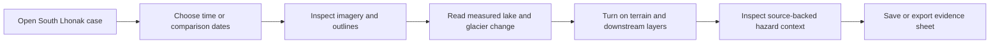

# Features and user journeys

## MVP features

### 1. Case-study landing view

The initial view frames South Lhonak Lake, the associated glacier, the 2023 GLOF, and the data coverage. It should use a map first; 3D terrain is an optional mode, not a replacement for legible analytical layers.

### 2. Temporal explorer

- Select a curated observation date or seasonal composite.
- Compare two dates with side-by-side and swipe modes.
- Display optical imagery plus a false-colour/index layer where helpful.
- Clearly label acquisition/composite date, sensor, cloud treatment, and spatial resolution.

### 3. Glacier and lake change layers

- Lake boundary for each supported date.
- Glacier outline or terminus line for each supported date.
- Lake-area time series.
- Glacier area and/or terminus-retreat time series.
- A change summary for the chosen start and end dates.

### 4. Terrain and connection view

- Hillshade and elevation.
- Slope layer.
- Lake, glacier, outlet, moraine/dam proxy, and downstream flow direction.
- A restrained 3D view to show valley geometry and spatial connection.

### 5. Hazard-context panel

Show indicators individually, with explanatory text and a source/method link:

- Lake size and rate of growth.
- Glacier proximity and terminus change.
- Dam/outlet and surrounding-slope observations where supported by imagery or literature.
- Elevation and terrain steepness.
- Downstream river path and published exposed assets/settlements, when data quality permits.

The panel may group indicators as *observed change*, *terrain context*, and *downstream context*. It must not imply a live probability of failure.

### 6. Event comparison

A dedicated pre-/post-October-2023 view shows changed lake extent and outlet surroundings. The accompanying narrative links only to sourced, published interpretations of the event trigger and impacts.

### 7. Evidence sheet

A compact exportable screen or PDF-ready page containing selected dates, maps, chart, values, data sources, and limitations.

## Core user journey

## Later features

- Search and compare several sites (begin with Tsho Rolpa as a future comparison case).
- Semi-automated lake-boundary extraction with analyst approval.
- Sentinel-1 SAR scenes for cloud-robust event analysis.
- Published flood-routing scenarios, only where methods and assumptions can be presented clearly.
- User annotations and reproducible analysis runs.
