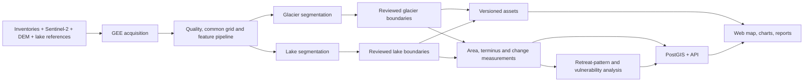

# Full architecture implementation plan

**Status (22 September 2026): not yet on track for a completed research release.** The project has a credible start: a Next.js evidence viewer, 32 candidate multi-date Sentinel-2 feature stacks across five sites, a documented preprocessing protocol, and fail-closed research gates. It does **not** yet have quality-accepted observations, stable-terrain alignment, reviewed dated labels, a trained/validated GeoAI model, real change measurements, cross-site analysis, a working API/database/tile-serving layer, or approved lake boundaries. Therefore the dashboard must continue to show only evidence and candidate status until the gates below pass.

This plan implements the six boxes in the supplied architecture and the four objectives. It deliberately separates scientific production from web presentation: Google Earth Engine (GEE) runs in controlled pipeline jobs; the browser never runs GEE or promotes outputs.

## 1. Target system and scope decisions



### Scope that must be frozen before implementation

1. **Scientific unit:** one named glacier complex and its associated lake(s) per site. The five named sites remain a target set, but only South Lhonak is currently verified for analysis. Sites with unresolved identity or lake association are excluded, not “filled in.”
2. **Time policy:** annual late-post-monsoon observations (1 October–30 November) from 2016–2025 where available; a separate pre/post October-2023 event pair; 2026 only after its observation window and review. Do not silently substitute a different season.
3. **Two segmentation products:** `glacier_mask` is the primary product for Objectives 2–4. `lake_mask` is required by the architecture for lake growth and glacier–lake relationships. They need separate label definitions, models/baselines, and validation; a glacier model must not be claimed to detect lakes.
4. **Vulnerability meaning:** a transparent relative *retreat/lake-change susceptibility index*, not GLOF probability, flood routing, exposure, or an early-warning score. Its inputs and weights must be published.
5. **Release principle:** only reviewed boundaries and validated measurements are published in the analytical UI. Candidate imagery may be displayed only with a clear “not approved for measurement” status.

## 2. Gap assessment against the requested architecture

| Architecture stage | Current state | What prevents completion |
| --- | --- | --- |
| 1. Data acquisition | 32 real candidate Sentinel-2 exports; inventories and DEM path are documented. | Every record is a candidate; early SR provenance needs correction/re-export; required source assets are not all locally versioned; some sites/dates lack usable coverage. |
| 2. Preprocessing in GEE | 13-band feature stacks, SCL quality masking, DEM features, common per-site grids, and patches exist. | Manual scene acceptance and measured inter-date co-registration are absent. The current research-readiness gate correctly blocks use. |
| 3. AI lake/glacier detection | Training/measurement commands are intentionally blocked without approved labels. Lake candidates use a threshold rule only. | No reviewed masks, no baseline/model evaluation, no uncertainty product, no accepted dated lake boundary series. |
| 4. Feature extraction | Feature rasters exist; no released measurements. | Area, terminus, elevation-band, perimeter/aspect and lake relation calculations need implementation and validation on reviewed geometry. |
| 5. Multi-temporal change analysis | No approved boundary pairs or change maps. | Requires aligned, reviewed boundaries; uncertainty/detection limits; a GEE-side change-map export and GIS verification. |
| 6. Output and visualization | Evidence-oriented Next.js UI exists. | It is not connected to the specified FastAPI/PostGIS/object-store architecture and must not display unsupported analytical results. |

## 3. Architecture to implement

### A. Data and processing layer

Create a `pipelines/` workflow with explicit stages. Each stage writes immutable, versioned outputs under `data/derived/planb/<stage>/<run-id>/` and a manifest record. Raw downloads/exports stay separate from derived products.

```text
data/catalog/planb/                 # Small, version-controlled metadata/evidence
  sites.json                        # identity, AOI, CRS, glacier/lake references
  observations.json                 # one record for each attempted date
  reviews.json                      # human scene/boundary decisions
  splits.json                       # frozen train/test assignments
  source-register.json              # licence/version/access/checksum
  model-registry.json               # approved model runs only
data/derived/planb/                 # reproducible outputs; large rasters outside Git
  raw/<site>/<observation>/
  imagery/<site>/<observation>/
  features/<site>/<observation>/
  labels/<site>/<observation>/
  predictions/<model-run>/<site>/<observation>/
  boundaries/<boundary-run>/<site>/<observation>/
  measurements/<measurement-run>/
  change-maps/<change-run>/<site>/<pair>/
  validation/<run-id>/
  release/<release-id>/
```

Every observation, model output, boundary and measurement must retain: `site_id`, date/window, source scene IDs, source and output hashes, CRS/grid, processing version, status, quality notes, reviewer decision, and parent asset IDs. A status transition is evidence, not a string change:

```text
candidate -> quality_accepted -> label_reviewed -> predicted
predicted -> boundary_reviewed -> measured -> released
```

### B. Serving and application layer

Implement the documented split rather than embedding measurements in TypeScript files.

| Component | Responsibility | First implementation |
| --- | --- | --- |
| Object storage / local equivalent | COG imagery, probability rasters, PMTiles/vector tiles, GeoParquet source assets and report files. | Local `data/derived` in development; S3-compatible bucket in deployment. |
| PostGIS | Sites, observation metadata, boundary metadata/geometries, measurements, events, citations and release state. | Docker Compose database plus migrations and seed from released manifests. |
| FastAPI | Read-only versioned endpoints; validates `released` state before returning a layer or metric. | `/sites`, `/sites/{id}/observations`, `/layers`, `/metrics`, `/changes`, `/risk`, `/provenance`. |
| Tile service | Raster COG and vector tile delivery, cache headers, date-specific URLs. | TiTiler or equivalent for COGs; PMTiles/vector tiles for approved vectors. |
| Next.js client | Map/time slider, paired-date comparison, layer legend, measurement chart, provenance and downloads. | Replace static hard-coded analytical values with API calls; retain local fixtures only as explicitly demo-labelled data. |

The API must expose a revision (`release_id`/`run_id`) with every response. UI requests must state the target date/pair and never calculate a scientific result in the browser.

## 4. Execution plan and quality gates

The phases are ordered by dependency. Work on interface scaffolding may overlap with acquisition, but no later scientific gate can be declared complete early.

### Phase 0 — establish a reproducible environment and research contract (2–4 days)

**Do**

1. Create a pinned Python environment with Rasterio/GDAL, GeoPandas, PyTorch or TensorFlow, scikit-learn, Earth Engine API, and tests. Add a lock file or container so the test suite runs identically for every contributor.
2. Move GEE project ID, authentication and bucket credentials to local `.env`/secret management. Remove project identifiers from narrative documentation where they are not necessary.
3. Finish the source register: each Sentinel, DEM, RGI/GLIMS, NASA HMA, ICIMOD, and reference-boundary item needs licence, version, access date, citation, local artifact location and SHA-256.
4. Freeze the label handbook for both classes: glacier, lake, background and ignored/unknown. Specify debris-covered ice, seasonal snow, shadow, supraglacial ponds, proglacial lake water and disconnected snow fields.
5. Finalize a reviewer workflow: analyst A digitizes; analyst B independently reviews test labels; disagreements are stored as a decision record. Model-assisted polygons cannot become independent test truth.

**Exit gate G1+ (environment and contract):** a clean clone runs all tests; every eligible site has verified identity/AOI/metric CRS; label and split policies are versioned; unresolved sites are excluded.

**Practical tests**

```sh
python3 -m unittest discover -s pipelines/tests -v
python3 pipelines/scripts/audit_planb.py
python3 pipelines/scripts/validate_catalog.py
```

The current suite has an environment failure because `rasterio` is missing from the interpreter used for the test command. Fixing this is an immediate prerequisite, not a scientific pass.

### Phase 1 — obtain and approve the multi-temporal data set (3–10 days, export queues permitting)

**Do**

1. Correct the 2016 collection strategy. Sentinel-2 SR Harmonized begins in 2017; use a clearly labelled compatible Level-1C/TOA path for 2016 **or** begin the SR analytical series in 2017. Never call pre-2017 data SR.
2. For each eligible site, inventory all scenes within the fixed window, score cloud/shadow/snow and terminus visibility, and record both accepted and rejected options.
3. Export at least three comparable South Lhonak dates spanning early, middle and late periods; include a dedicated pre-/post-event pair. For each subsequent site, require at least two usable dates before it is added to comparative analysis.
4. Export spectral bands (`B2,B3,B4,B8,B11`), SCL/quality bands, scene metadata and a reproducible RGB preview. Preserve individual scene IDs even if a composite is used.
5. Run common-grid processing and feature construction. Continuous bands use documented interpolation; categorical masks use nearest-neighbour; invalid pixels stay `unknown`, never background.
6. Measure co-registration on stable bedrock using a reproducible algorithm and manual spot checks. Store residual displacement per pair; reject/realign pairs exceeding 0.5 pixel.
7. A reviewer checks glacier terminus and lake edge visibility for every candidate and moves only defensible records to `quality_accepted`.

**Exit gate G2:** South Lhonak has three or more manually accepted, source-complete, aligned observations; each source asset is locally resolvable and hashed; no unresolved pre-SR provenance; alignment residual is <=0.5 pixels for every usable pair.

**Practical tests**

```sh
python3 pipelines/scripts/validate_research_readiness.py
python3 pipelines/geoai/prepare_features.py --manifest data/catalog/planb/observations.json --dry-run
python3 pipelines/scripts/validate_alignment.py --help
```

Expected now: readiness **fails**. Expected after this phase: it passes only for eligible, approved site/date records.

### Phase 2 — construct independent labels and transparent baselines (4–10+ days; reviewer-dependent)

**Do**

1. Digitize glacier and lake masks for the quality-accepted South Lhonak dates against imagery, DEM hillshade and external references. Assign `255` to cloud/shadow/ambiguous pixels. Do not make a geometry complete-looking by guessing hidden edges.
2. Have the independent reviewer inspect all held-out labels before model tuning. Record agreement measures (IoU, boundary distance) and reconcile only training labels; retain original independent test labels.
3. Build two non-ML benchmarks:
   - glacier: NDSI/NDVI plus terrain/shadow rules, morphology and inventory-constrained cleanup;
   - lake: NDWI/MNDWI plus slope/terrain and connected-component rules.
4. Create the training-mask raster and verify it matches each feature raster exactly in CRS, transform, dimensions and NoData semantics.
5. Populate frozen temporal and leave-one-glacier-out splits by whole acquisition, never pixels or neighbouring patches from the same scene.

**Exit gate G3:** review records exist; every training/testing pair is spatially matched; labels are independently held out; baseline outputs and error maps are reproducible.

**Practical tests**

```sh
python3 pipelines/geoai/build_training_masks.py --reviews data/catalog/planb/reviews.json
python3 pipelines/geoai/train_segmentation.py --help
# Add a test that deliberately shifts a label grid by one pixel; it must fail.
```

### Phase 3 — train, evaluate and review GeoAI segmentation (5–10 days)

**Do**

1. Start with a Random Forest pixel/patch baseline using the 13 features. It is fast, inspectable and reveals data errors early.
2. Add a U-Net or SegFormer only after the baseline and label count justify it. Feed 13-channel tiles, mask ignored pixels in the loss, use augmentation that does not change terrain meaning, and maintain a separate model for glacier/lake unless a multi-class model demonstrably improves both.
3. Save model config, code revision, random seed, feature schema, train/validation/test asset hashes, threshold and post-processing parameters.
4. Evaluate on chronological holdouts and leave-one-glacier-out folds. Report IoU/F1/Dice, precision/recall, boundary Hausdorff or mean distance, glacier area error and lake area error by site/date/quality class.
5. Produce probability rasters, masks, uncertainty masks and vectorized polygons. Flag low-confidence terminus/lake-edge regions for human review.
6. A glacier analyst reviews predictions. Only reviewed boundaries become `boundary_reviewed`; retain raw prediction separately.

**Exit gate G4:** both baseline and GeoAI metrics are computed from held-out labels; all claims identify sample count and folds; GeoAI either has a documented improvement or the baseline remains the approved method. No target accuracy threshold may be invented after inspection.

**Practical tests**

```sh
# Same input and seed must yield equivalent metrics/model manifest.
python3 pipelines/geoai/train_segmentation.py ...
python3 pipelines/geoai/evaluate_models.py ...
# Alter feature-band order, inject a train/test duplicate, or replace unknown with background:
# each must fail validation.
```

### Phase 4 — calculate features, boundaries and validated multi-temporal change (4–8 days)

**Do**

1. Implement `measure_retreat.py` to consume only `boundary_reviewed` glacier/lake vectors plus their quality masks. It must fail on candidates, model-only boundaries or mismatched grids.
2. Calculate glacier area (km²), lake area (km²), perimeter, elevation-band area, terminus position along a documented centreline, terminus retreat distance, annualized rate, glacier–lake distance/adjacency and lake-growth change.
3. Compute uncertainty: spatial resolution/boundary buffer error, alignment residual, cloud/unknown coverage, date interval and method variance. Report detection limits and mark small changes as indeterminate.
4. Build pairwise GEE change layers (e.g. NDSI/NDWI difference, classified glacier/lake persistence/loss/gain) from the same approved date pair. Export rasters and polygons with the pair ID; do not rely on a visually attractive screenshot.
5. Validate one South Lhonak interval independently in QGIS/GIS against published values where method compatibility permits. Investigate material disagreement before extension.

**Exit gate G5:** at least one approved glacier and lake interval has reproduced metrics, uncertainty, validated change map, and an audit trail from published number to source scene.

**Practical tests**

```sh
python3 pipelines/geoai/measure_retreat.py --boundary-manifest <approved-manifest>
# Identical boundary pair -> zero change within tolerance.
# Mismatched CRS -> hard failure.
# An ignored/cloud terminus -> result marked indeterminate, not a numeric retreat.
```

### Phase 5 — extend to five sites and analyse patterns/vulnerability (10–20+ days)

**Do**

1. Resolve the remaining four site identities and repeat G2–G5; do not train them merely because a raster exists.
2. Assemble a tidy measurement table keyed by `site_id`, observation date, method/version and uncertainty. Use actual intervals rather than pretending each pair is one year apart.
3. Analyze temporal patterns: area/terminus rates, breakpoints, pre/post-event comparison, elevation-band loss, lake-growth co-change and data gaps. Normalize comparison where appropriate, but preserve absolute values.
4. Analyze spatial patterns: map retreat magnitude/rate, elevation/aspect/slope/debris/terminus-lake context and uncertainty.
5. Define a sensitivity-tested relative vulnerability index. Example components: normalized recent retreat rate, glacier–lake adjacency/change, low-elevation terminus fraction and data-quality penalty. Publish weights, normalization, missing-data rule and a sensitivity run with alternative weights. Do not call this a GLOF risk probability.
6. Have a domain reviewer verify the interpretation and limitations.

**Exit gate G6:** cross-site plots include only approved data; every map has uncertainty/provenance; the vulnerability index is reproducible, sensitivity-tested and plainly bounded.

### Phase 6 — publish the API, map products and reports (3–6 days)

**Do**

1. Add PostGIS migrations and import scripts that only ingest `released` manifest items. Keep asset metadata linked to the exact file hash and model/measurement run.
2. Build FastAPI read endpoints, OpenAPI tests and signed/controlled tile URLs. Enforce `release_status == released` at query time.
3. Publish approved COGs and vector/PMTiles assets. Verify map projection, legends, units and rendering at desktop/mobile widths.
4. Update the web client: date/time selector, side-by-side imagery/change slider, glacier and lake boundaries, uncertainty overlay, area/terminus charts, vulnerability map, provenance drawer, downloads and report export.
5. Add visible statuses: `candidate`, `reviewed`, `released`, `gap`, and `indeterminate`. Hide forecast/alert language because it is outside the accepted objectives.
6. Produce a research-release report: methods, sources, model results, measurements, limitations, full reproducibility commands and a frozen release manifest.

**Exit gate G7:** a reviewer can follow any displayed figure/metric backwards to released assets and code/configuration; API rejects non-released data; no UI text overstates GLOF risk or model validation.

## 5. Delivery order and realistic milestones

| Milestone | Outcome | Depends on | Evidence |
| --- | --- | --- | --- |
| M0 | Reproducible environment and verified contract | none | working geospatial test environment, source register, label policy |
| M1 | South Lhonak approved multi-date input | M0 | G2 passes |
| M2 | Reviewed glacier and lake references | M1 + human reviewer | G3 passes |
| M3 | Validated segmentation and reviewed dated boundaries | M2 | G4 passes |
| M4 | First real glacier/lake change result | M3 | G5 passes |
| M5 | Five-site patterns and bounded susceptibility analysis | M4 repeated per site | G6 passes |
| M6 | API-backed dashboard and research release | M5 | G7 passes |

The hard dependency is human review. Engineering can accelerate exports, validation, schemas and UI scaffolding, but it cannot manufacture independent glacier/lake truth or declare a candidate scene scientifically usable.

## 6. Immediate backlog (next 10 actions)

1. Repair the pinned pipeline environment so Rasterio-backed tests run, then record the exact interpreter/dependency version.
2. Run the authoritative readiness gate and preserve its current failures as the baseline.
3. Decide and document the 2016 policy (Level-1C versus starting the analytical SR series in 2017), then re-export/relabel affected records.
4. Version required source assets locally and complete their source-register entries.
5. Select and manually inspect three South Lhonak dates plus the 2023 event pair.
6. Run and record stable-terrain co-registration for all selected pairs; realign or reject failures.
7. Mark only reviewed scenes `quality_accepted`; leave all others as candidates/rejected.
8. Digitize and independently review glacier and lake masks for the accepted pilot dates.
9. Implement and test transparent glacier/lake baselines before training a neural network.
10. Implement measurement/change-map contracts and build the FastAPI/PostGIS schema in parallel, keeping it disconnected from unreleased research data.

## 7. Definition of done

The requested architecture is complete only when all of the following are demonstrably true:

- Objective 1: every included site/date has documented, quality-accepted multi-temporal Sentinel-2 input, preprocessing, provenance and alignment evidence.
- Objective 2: reproducible glacier (and architecture-required lake) delineation has independent held-out validation, uncertainty outputs and reviewed boundaries.
- Objective 3: approved dated boundaries yield reproducible area/terminus/lake changes and exported GEE change maps with uncertainty and unknown pixels retained.
- Objective 4: the multi-site spatial/temporal analysis and susceptibility index use only validated measurements and state their geographic/scientific limitations.
- Product architecture: released assets flow through object storage/PostGIS/FastAPI to the web UI; every displayed result resolves to a release manifest, source, method and review record.

Passing code tests alone is not enough. The final scientific gates require actual imagery inspection, independent label review and domain sign-off.
