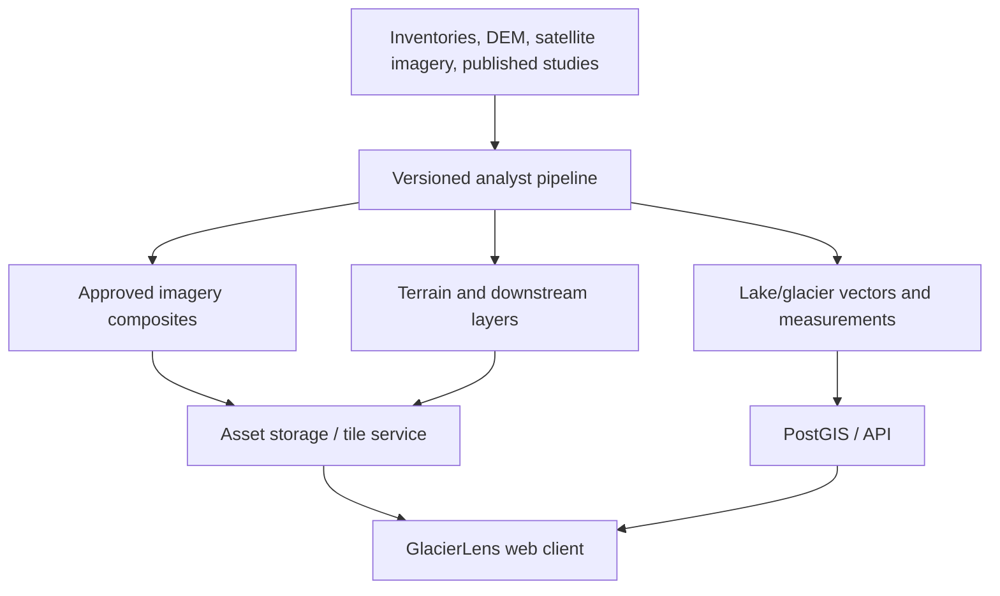

# Technical architecture and stack

## Architectural decision

For the POC, use **precomputed and versioned research assets** rather than asking the browser to run live remote-sensing analysis. This is faster, reproducible, easier to cite, and prevents a web interface from becoming dependent on interactive Earth Engine sessions.

Google Earth Engine can be used during the analyst pipeline to generate imagery composites and derived layers. The public application serves approved outputs only.

The user has a Google Earth Engine account. Its project identifier and credentials must remain local configuration; they must never be committed to this repository or exposed to the browser.

## Proposed stack

| Layer | Choice | Why |
| --- | --- | --- |
| Web application | Next.js + TypeScript | Strong component model and straightforward deployment. |
| Map and analytical layers | MapLibre GL JS | Open vector/raster layers and good 2D analytical interaction. |
| 3D globe / terrain | CesiumJS | Mature terrain, imagery, camera, and 3D geospatial capabilities. Use only where 3D adds interpretation. |
| Charts | Observable Plot or D3 | Accessible, interactive time-series charts. |
| API | FastAPI (Python) | Natural fit for geospatial and research-processing utilities. |
| Spatial data | PostGIS + object storage | Queryable metadata/vectors plus efficient delivery of imagery/tiles. |
| Analysis pipeline | Python, GeoPandas, Rasterio, xarray, Earth Engine Python API | Reproducible data preparation and geospatial calculations. |
| Raster/vector publication | Cloud-Optimized GeoTIFFs, GeoParquet/GeoJSON, PMTiles or vector tiles | Web-efficient, inspectable data formats. |
| Deployment | Static frontend + containerised API | Keeps the first deployment simple and portable. |

## POC shape



## Suggested repository layout

```text
apps/web/                 # Next.js user interface
services/api/             # FastAPI service
pipelines/                # reproducible data-preparation jobs
data/catalog/             # source metadata, asset manifests, licences
data/derived/             # generated locally only; not committed if large
docs/                     # product, method, and decision documents
```

## Modularity and scaling rules

The application must be **site-agnostic** and bounded to the five approved final study sites. South Lhonak is data, not a special code path.

- A `SiteConfig` record defines a lake/glacier pair, geometry references, centre point, supported dates, event dates, labels, and citations.
- A `DatasetManifest` describes each raster/vector asset and its provenance. The UI reads manifests; it does not embed asset URLs or scientific values in components.
- Map layers conform to a common layer contract (`id`, `type`, `source`, `dateCoverage`, `legend`, `provenance`). New analytical layers plug into the same registry.
- Measurements conform to one time-series schema (`site_id`, `metric_id`, `observation_date`, `value`, `unit`, `method`, `quality_notes`). Charts render schemas, rather than lake-specific files.
- Domain modules are isolated: `sites`, `imagery`, `boundaries`, `terrain`, `metrics`, `events`, and `citations`.
- API endpoints use stable plural resources such as `/sites`, `/sites/{id}/layers`, `/sites/{id}/metrics`, and `/sites/{id}/events`.
- No component may call Google Earth Engine directly. The preparation pipeline is the sole GEE integration boundary.

This lets the second site be added by registering its configuration and assets, then validating the same pipeline and interface.

## Non-negotiable implementation details

- Every generated layer carries `source`, `method`, `observation_date`, `processing_date`, `resolution`, and `confidence/quality_notes` metadata.
- All comparison calculations use the same spatial reference and documented seasonal windows.
- The UI defaults to the last verified curated asset, never to an unverified live calculation.
- Keep raw source data, derived assets, and presentation metadata separate.
- Use role-free public read access for the POC; do not collect user data.
- Keep GEE project IDs, tokens, and service-account material in local environment configuration only.
